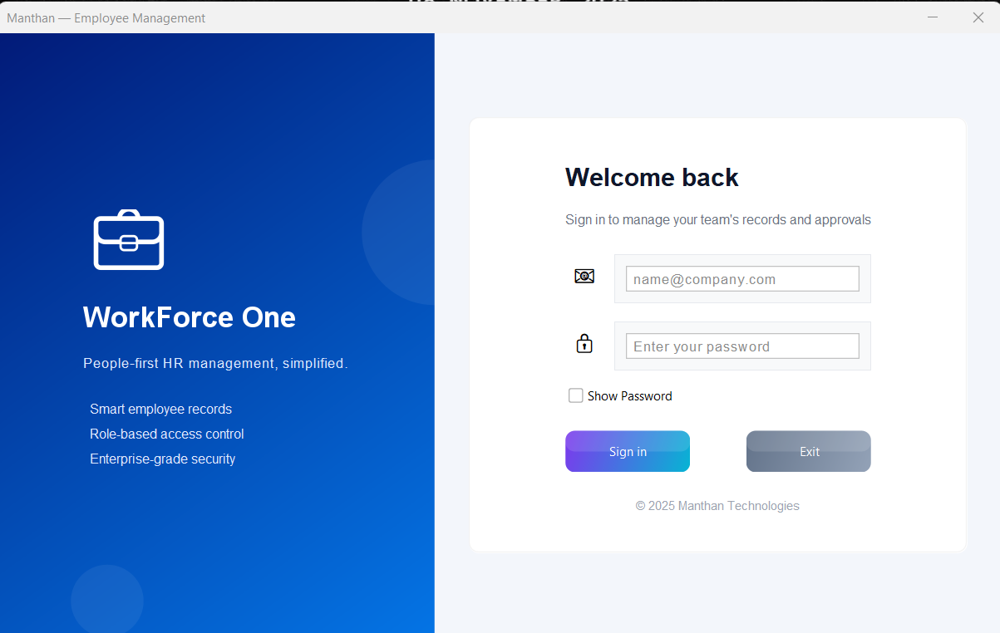
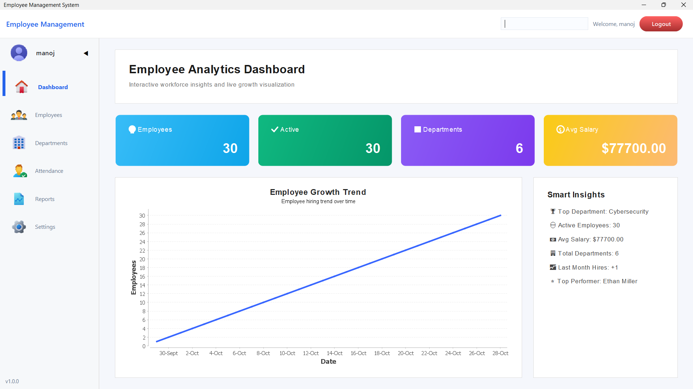
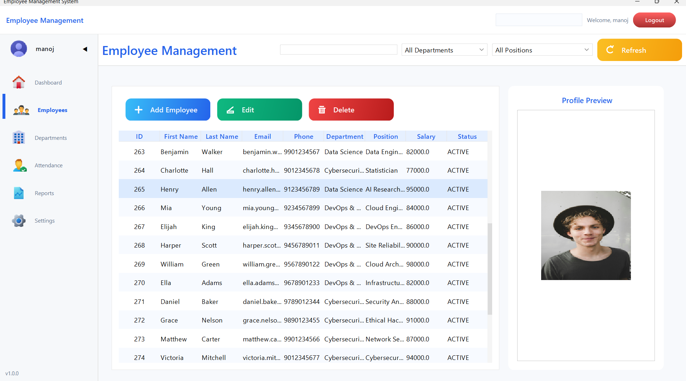
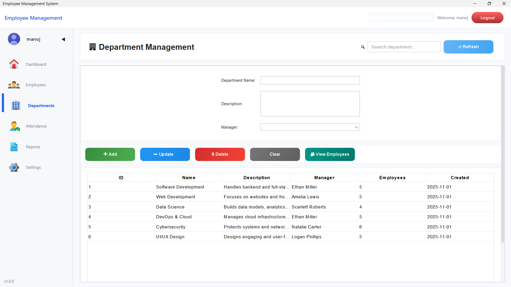
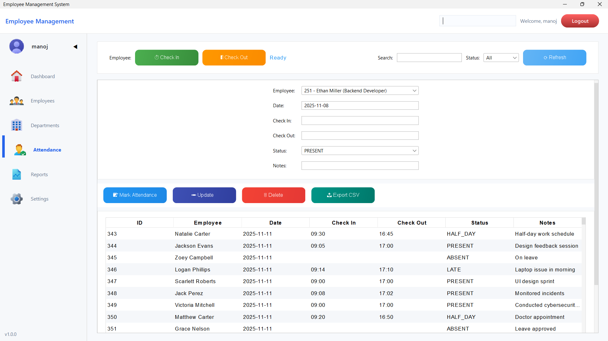
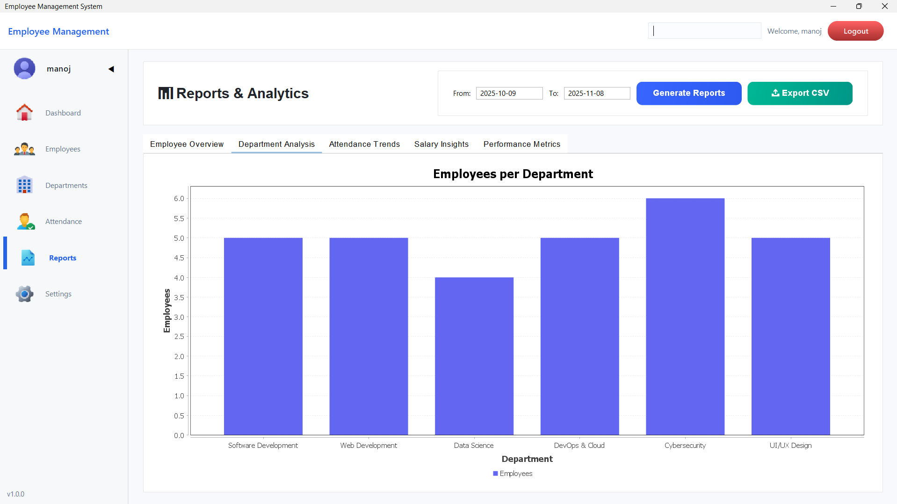
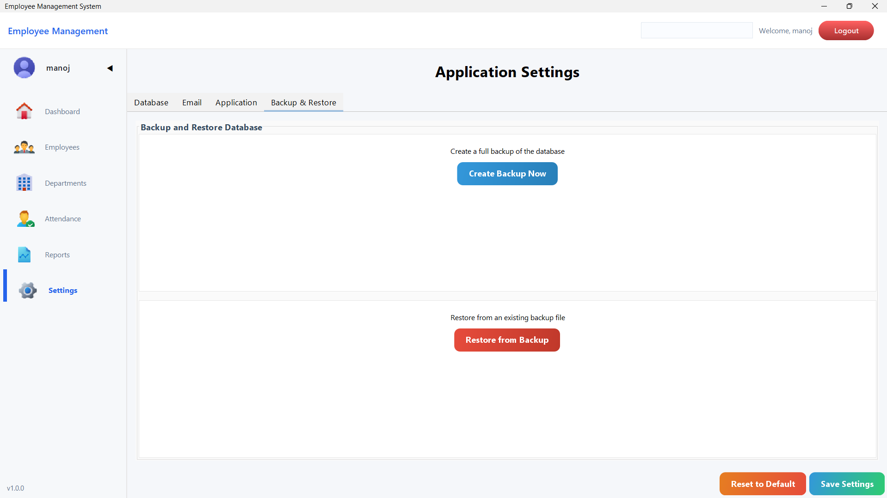

# 🧑‍💼 Employee Management System (Java)

<table align="center">
  <tr>
    <td align="center" width="150">
      <br>
      <b>Java</b>
    </td>
    <td align="center" width="150">
      <br>
      <b>MySQL</b>
    </td>
    <td align="center" width="150">
      <br>
      <b>Maven</b>
    </td>
    <td align="center" width="150">
      <br>
      <b>Git</b>
    </td>
  </tr>
</table>


---

## 📘 Overview

The **Employee Management System (EMS)** is a Java-based desktop application designed to efficiently manage employee data.  
It supports adding, updating, deleting, and viewing employee records, backed by a secure MySQL database.

This system demonstrates core concepts of Java GUI development, JDBC database connectivity, and modular programming with DAO architecture.

---

## ✨ Key Features

- 👥 **Employee Management** – Add, update, delete, and search employees.  
- 🏢 **Department Handling** – Manage departments and assign employees.  
- 💾 **Persistent Storage** – All data stored securely in a MySQL database.  
- 🧰 **Backup & Logging** – Automatic data backups and logs maintained.  
- ⚙️ **Configurable Settings** – Modify DB and email configurations easily.  
- 🎨 **Modern GUI** – Built using Java Swing and FlatLaf for a clean look.  

---

## 🛠️ Tech Stack

| Component | Technology Used |
|------------|-----------------|
| **Language** | Java (JDK 17+) |
| **Database** | MySQL |
| **Build Tool** | Apache Maven |
| **UI Framework** | Swing + FlatLaf |
| **IDE (Recommended)** | IntelliJ IDEA / Eclipse |

---

## 📂 Project Structure
```
EmployeeManagementSystem-Java/
│
├── src/
│ ├── main/java/com/employee/
│ │ ├── dao/ # Data Access Objects
│ │ ├── model/ # Model classes (Employee, Department, etc.)
│ │ ├── gui/ # GUI components (Swing)
│ │ └── utils/ # Utility classes
│ │
│ └── main/resources/ # Config files and assets
│
├── employee_management.sql # Database schema
├── pom.xml # Maven dependencies
├── LICENSE # License file
└── README.md # Documentation
```

---

## ⚙️ Installation & Setup

### 1. Clone the Repository
```bash
git clone https://github.com/manoj-sys-core/EmployeeManagementSystem-Java.git
cd EmployeeManagementSystem-Java
```
### 2. Database Setup

Create a database named employee_management in MySQL.

Import the SQL file:
```bash
mysql -u <username> -p < database_name < employee_management.sql
```
Replace <username> and <database_name> with your credentials.
### 3. Configure Database Connection

Edit your configuration file (e.g., application.properties or equivalent):
```bash
db.url=jdbc:mysql://localhost:3306/employee_management
db.username=root
db.password=yourpassword
```
### 4. Build & Run

Run Maven to clean and build the project:
```bash
mvn clean install
```
Then execute:
```bash
java -jar target/EmployeeManagementSystem.jar
```
---
## 🖼️ Demo Screenshots
### 🔐 Login Screen
> The secure login interface for administrators and employees.
<p align="center">
  
</p>

---

### 🏠 Dashboard
> A modern, intuitive dashboard providing an overview of key metrics and quick access to modules.
<p align="center">
  
</p>

---

### 👥 Employee Management
> Manage all employee records — add, update, delete, or view employee details.
<p align="center">
  
</p>

---

### 🏢 Department Management
> Create and organize departments, assign employees, and manage departmental data.
<p align="center">
  
</p>

---

### 📅 Attendance Tracking
> Track daily attendance, working hours, and leave records.
<p align="center">
  
</p>

---

### 📊 Reports
> Generate detailed reports for employees, departments, and attendance insights.
<p align="center">
  
</p>

---

### ⚙️ Settings Panel
> Configure database connections, backups, email settings, and more.
<p align="center">
  
</p>

---
## ⚙️ Configuration Options

You can adjust configurations for:

Database Connection

Email Credentials

Backup & Log Paths

Example:
```
app.backup.path=./backups/
app.logs.path=./logs/
email.username=your_email@gmail.com
email.password=your_app_password
```
---
## 🧾 License

This project is licensed under the Apache License 2.0.
See the LICENSE
 file for more information.
 ```
 Licensed under the Apache License, Version 2.0 (the "License");
you may not use this file except in compliance with the License.
You may obtain a copy of the License at:

    http://www.apache.org/licenses/LICENSE-2.0
```
---
## 🌟 Acknowledgments

### 1.Developed by Manoj S

### 2.GUI designed using FlatLaf

### 3.Inspired by modern HR and employee management systems
---
#### ⭐ If you found this project helpful, consider giving it a star!

---
